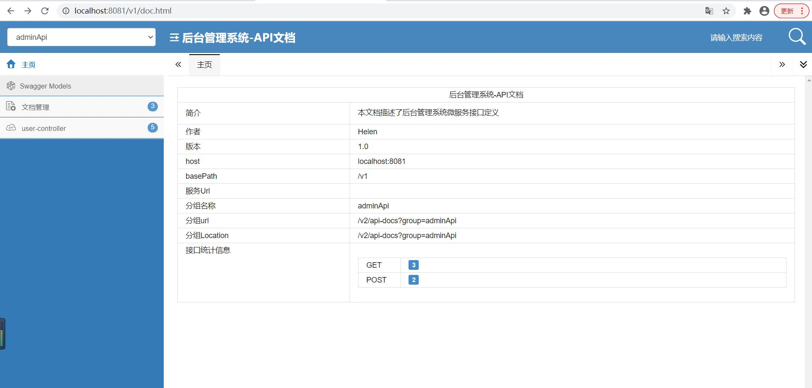
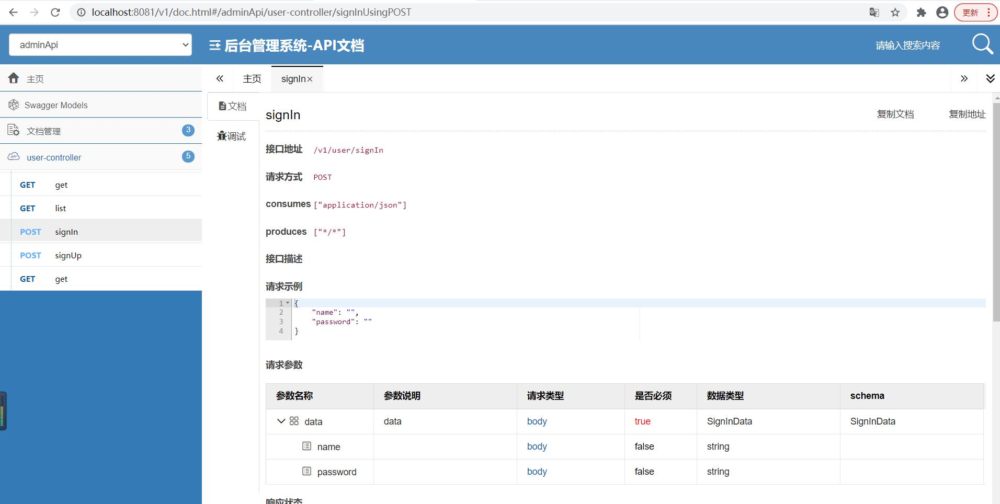
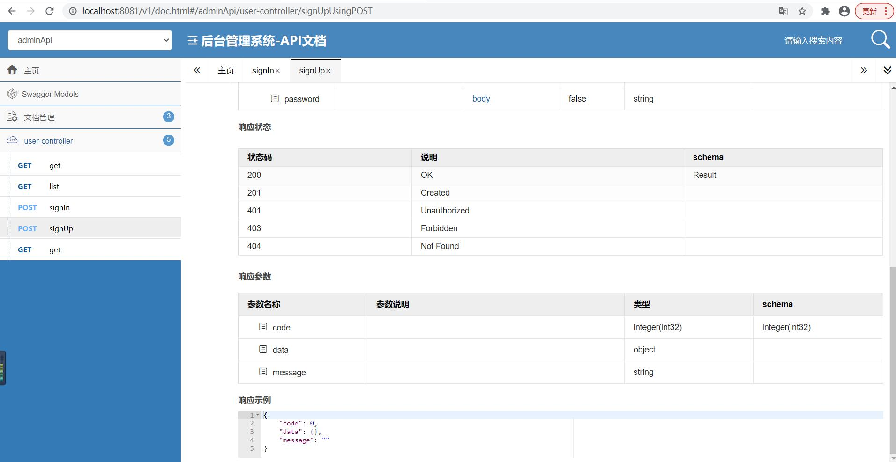

# Swagger-Bootstrap-UI集成

## 简述
swagger-bootstrap-ui是springfox-swagger的增强UI实现，为Java开发者在使用Swagger的时候，能拥有一份简洁、强大的接口文档体验。
## 如何使用
直接访问路径`http://localhost:8081/v1/doc.html`即可访问到swagger-bootstrap-ui页面。

配置类的位置在`scaffold/auth/config/SwaggerConfig.java`
```java_holder_method_tree
@Configuration
@EnableSwagger2
@EnableSwaggerBootstrapUI
public class SwaggerConfig {
    @Bean
    public Docket adminApiConfig(){

        return new Docket(DocumentationType.SWAGGER_2)
                .groupName("adminApi")
                .apiInfo(adminApiInfo())
                .select()
                //在其他项目中创建Controller时需要添加如下代码指定位置
                .apis(RequestHandlerSelectors.basePackage("com.jxys.scaffold.user.controller"))
                .paths(PathSelectors.any())
                .build();

    }

    private ApiInfo adminApiInfo(){

        return new ApiInfoBuilder()
                .title("后台管理系统-API文档")
                .description("本文档描述了后台管理系统微服务接口定义")
                .version("1.0")
                .contact(new Contact("Helen", "http://localhost:8081", "a2417978181@163.com"))
                .build();
    }
}
```


##### swagger-bootstrap-ui只是springfox-swagger的UI工具，所以正常的`@API()`等注解可以正常使用。

## 项目展示图片


#

#



>当然项目中还保留了springfox-swagger-ui 如不需要则可可以去除。
#
>springfox-swagger-ui访问地址 `http://localhost:8081/v1/swagger-ui.html`
>